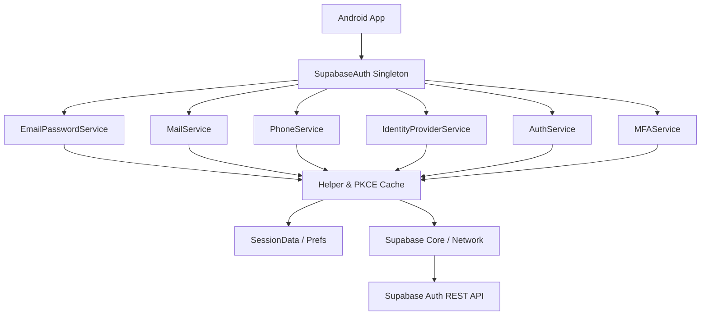
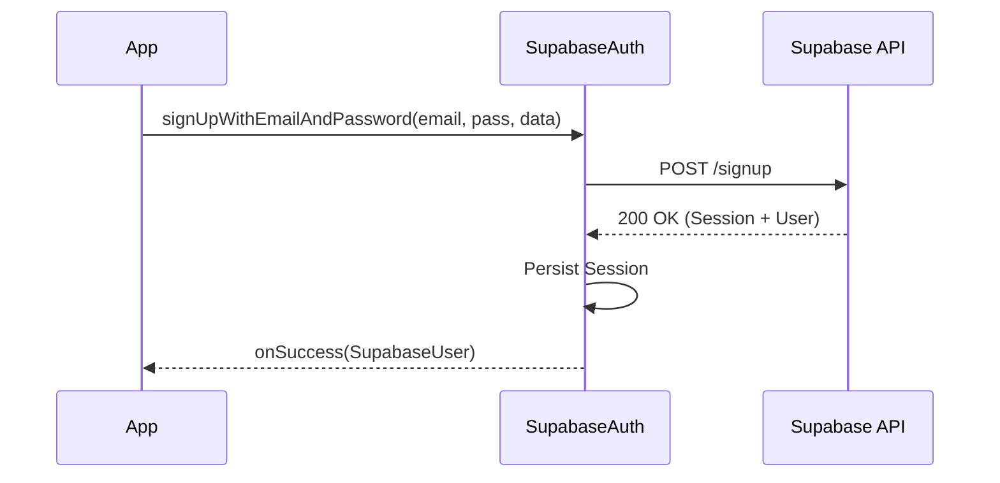
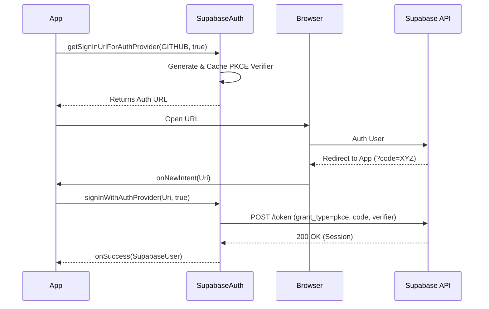
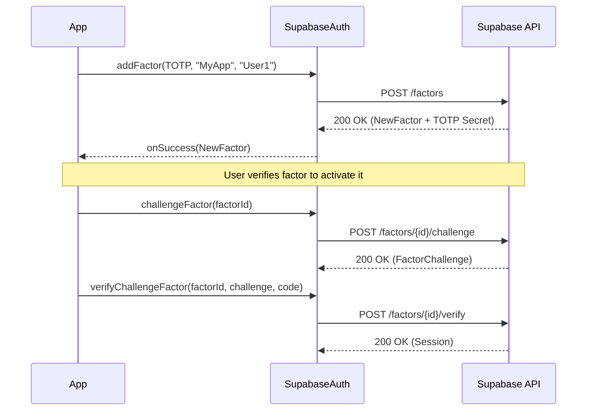
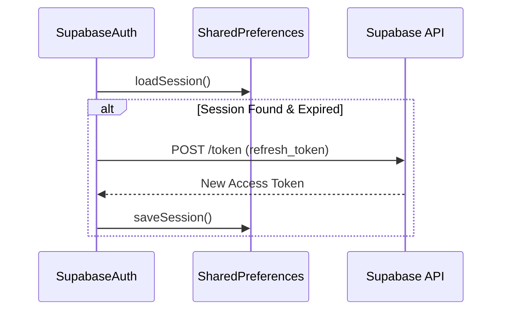

# Supabase Auth Module

A lightweight, production-ready Android library for integrating Supabase Authentication into your Android applications. This module provides a high-level, thread-safe Java API for user management, session persistence, and secure authentication flows.

---

# Features

- **Email & Password Authentication**: Standard registration and login flows.
- **OAuth Authentication**: Secure third-party login (GitHub, Google, Discord, etc.) using **PKCE**.
- **ID Token Sign-In**: Authenticate using tokens from Google, Apple, Facebook, etc.
- **Magic Link**: Passwordless login via email links.
- **Phone OTP**: SMS and WhatsApp-based one-time passwords.
- **Session Management**: Automatic persistence in SharedPreferences and background token refreshing.
- **User Management**: Update user metadata, email, and phone numbers.
- **Password Recovery**: Secure password reset flows.
- **Multi-Factor Authentication (MFA)**: Enroll and verify additional factors like **TOTP** and **Phone** for enhanced security.
- **Async Execution**: All network operations run on background threads with callback results.

---

# Architecture

The module uses a facade pattern with a service-based internal architecture.



### Layer Responsibilities
- **SupabaseAuth**: Single entry point for developers. Delegates to specialized services.
- **Specialized Services**: Contain the business logic and endpoint mapping for specific auth domains.
- **Helper**: Centralizes URL construction, error generation, and session state checks.
- **SessionData**: Manages local persistence using SharedPreferences and synchronizes tokens with the core module.
- **Supabase Core**: Provides the underlying network client and global configuration.

---

# Complete Authentication Workflow

## Sign Up Workflow (Email/Password)

1. App calls `signUpWithEmailAndPassword`.
2. SDK sends POST request to `/auth/v1/signup`.
3. Server returns User and Session data.
4. SDK saves session locally and notifies the callback.



## OAuth PKCE Workflow

1. App gets the SignIn URL. SDK generates a "Code Verifier" and "Code Challenge".
2. App opens the URL in a browser.
3. User authenticates; server redirects back to the app with an `auth_code`.
4. App passes the URI to the SDK.
5. SDK exchanges the `auth_code` and the saved `verifier` for a session.



---

# Initialization

Initialize the core Supabase client first, then get the Auth instance.

```java
// Root initialization (usually in Application class)
SupabaseConfig config = new SupabaseConfig("https://your-project.supabase.co", "your-anon-key");
Supabase.initialize(config);

// Get Auth instance
SupabaseAuth auth = SupabaseAuth.getInstance(context);
```

---

# Configuration

### Required Permissions
```xml
<uses-permission android:name="android.permission.INTERNET" />
```

### Installation
```kotlin
plugins {
    id("io.github.maskmasteruk.supabase") version "0.0.1"
}

dependencies {
    implementation("io.github.maskmasteruk:supabase-android-core:0.0.1")
    implementation("io.github.maskmasteruk:supabase-android-auth:0.0.1")
}
```

---

# Public API Documentation

## `SupabaseAuth`

### `getInstance(Context context)`
- **Purpose**: Returns the thread-safe singleton instance of the Auth SDK.
- **Parameter**: `context` - The Android context (converted to application context internally).
- **Returns**: `SupabaseAuth` instance.

### `getCurrentUser()`
- **Purpose**: Synchronously returns the currently logged-in user from the local session.
- **Returns**: `SupabaseUser` or `null` if no session exists.

### `signUpWithEmailAndPassword(String email, String password, Map<String, Object> userData, AuthCallback callback)`
- **Purpose**: Creates a new user account.
- **Parameters**:
    - `email`: User's email.
    - `password`: User's password.
    - `userData`: Optional metadata map.
    - `callback`: Result callback.
- **Internal Workflow**: Hits `POST /signup`. Automatically logs in the user upon success.

### `signInWithEmailAndPassword(String email, String password, AuthCallback callback)`
- **Purpose**: Authenticates a user with email and password.
- **Parameters**: `email`, `password`, `callback`.
- **Internal Workflow**: Hits `POST /token` with `grant_type=password`.

### `signOut(OnCompleteCallback callback)`
- **Purpose**: Ends the session on the server and clears local data.
- **Internal Workflow**: Hits `POST /logout`. Local data is cleared even if the network call fails.

### `signOut()`
- **Purpose**: Synchronous sign-out (background thread) without a callback.

### `sendOtpToPhone(String phone, PhoneChannel channel, OnCompleteCallback callback)`
- **Purpose**: Sends a verification code to a phone number.
- **Parameters**:
    - `phone`: E.164 format.
    - `channel`: `SMS` or `WHATSAPP`.

### `verifyPhoneOTP(String phone, String otp, OnVerifyCallback callback)`
- **Purpose**: Verifies a phone code and establishes a session.
- **Internal Workflow**: Hits `POST /verify` with type `sms`.

### `resendPhoneChangeConfirmation(String phone, OnCompleteCallback callback)`
- **Purpose**: Resends code for a phone change operation.

### `resendPhoneVerification(String phone, OnCompleteCallback callback)`
- **Purpose**: Resends the initial phone verification SMS.

### `getSignInUrlForAuthProvider(AuthProviders.OAuthProviders provider, boolean enableCodeVerify, String redirectTo)`
- **Purpose**: Generates a URL for OAuth login.
- **Note**: If `enableCodeVerify` is true, PKCE is handled automatically.

### `signInWithAuthProvider(Uri uri, boolean isCodeVerifyEnabled, AuthCallback callback)`
- **Purpose**: Completes OAuth login after browser redirection.

### `signInWithIdToken(AuthProviders.IDTokenProviders provider, String idToken, AuthCallback callback)`
- **Purpose**: Authenticates using a token from a provider (e.g. Google Sign-In).

### `handleUpdateEmailCallback(Uri uri, AuthCallback callback)`
- **Purpose**: Processes the confirmation URI received after a user clicks an email update link.

### `sendLoginLinkToEmail(String email, String redirectTo, OnCompleteCallback callback)`
- **Purpose**: Sends a Magic Link login email.

### `sendSignupLinkToEmail(String email, String redirectTo, Map<String, Object> userData, OnCompleteCallback callback)`
- **Purpose**: Sends a Magic Link signup email.

### `sendPasswordResetMail(String email, String redirectTo, OnCompleteCallback callback)`
- **Purpose**: Sends a password recovery email.

### `sendEmailUpdateVerificationMail(String newEmail, String redirectTo, OnCompleteCallback callback)`
- **Purpose**: Sends a verification email to a new address to confirm an email change.

### `verifyEmailOTP(String email, String otp, OnVerifyCallback callback)`
- **Purpose**: Verifies an email OTP code.

### `resendSignUpEmail(String email, OnCompleteCallback callback)`
- **Purpose**: Resends the signup confirmation email.

### `resendEmailChangeConfirmation(String email, OnCompleteCallback callback)`
- **Purpose**: Resends the email change confirmation message.

### `resetPasswordWithOtp(String email, String password, String otp, OnCompleteCallback callback)`
- **Purpose**: Sets a new password using an OTP sent to email.

### `resetPasswordWithOtp(String password, String otp, OnCompleteCallback callback)`
- **Purpose**: Overload for setting a new password for the current user using an OTP.

### `resetPasswordWithCallback(Uri uri, String password, OnCompleteCallback callback)`
- **Purpose**: Sets a new password using a recovery session from a link.

### `updateUserData(Map<String, Object> userData, AuthCallback callback)`
- **Purpose**: Updates the custom metadata for the current user.

### `loginWithMagicLink(Uri uri, AuthCallback callback)`
- **Purpose**: Authenticates a user using the URI received from a Magic Link email.

### `reauthenticate(OnCompleteCallback callback)`
- **Purpose**: Verifies that the current session is still valid by hitting the server's reauthenticate endpoint.

### `addFactor(FactorType factorType, String issuer, String name, OnFactorCreatedCallback callback)`
- **Purpose**: Enrolls a new MFA factor for the current user.
- **Parameters**:
    - `factorType`: Type of MFA (e.g., `TOTP`).
    - `issuer`: Name of the service providing the factor.
    - `name`: User-friendly name for the factor.
    - `callback`: Returns `NewFactor` containing enrollment details (like TOTP URI/Secret).

### `challengeFactor(String factorID, OnGetFactorChallengeCallback callback)`
- **Purpose**: Initiates a verification challenge for an enrolled MFA factor.
- **Parameters**:
    - `factorID`: The ID of the factor to challenge.
    - `callback`: Returns `FactorChallenge` with challenge details.

### `verifyChallengeFactor(String factorID, FactorChallenge challenge, String code, OnCompleteCallback callback)`
- **Purpose**: Completes an MFA challenge using a verification code.
- **Parameters**:
    - `factorID`: The factor ID.
    - `challenge`: The challenge object obtained from `challengeFactor`.
    - `code`: The verification code provided by the user.

### `listAllFactors(OnGetFactorsCallback callback)`
- **Purpose**: Retrieves all MFA factors enrolled for the current user.

### `deleteFactor(String factorID, OnCompleteCallback callback)`
- **Purpose**: Removes an enrolled MFA factor.

---

# Multi-Factor Authentication (MFA)

The SDK supports Multi-Factor Authentication using TOTP (Time-based One-Time Password) and Phone factors.

## MFA Workflow

1. **Enrollment**: User adds a factor (e.g., TOTP) using `addFactor`.
2. **Verification**: User completes the initial challenge to verify the factor.
3. **Login Challenge**: On subsequent logins, if MFA is required, the app initiates a challenge using `challengeFactor`.
4. **Login Verification**: User provides the code from their authenticator app, verified via `verifyChallengeFactor`.



---

# Session Management

The SDK manages the token lifecycle automatically.



- **Restoration**: Occurs on `SupabaseAuth.getInstance()`.
- **Refresh**: Triggered automatically if `access_token` is expired during initialization or before requests.

---

# Error Handling

Callbacks return a `SupabaseError`.
- `invalid_credentials`: Incorrect email/password.
- `user_already_exists`: Email already in use.
- `otp_expired`: Code is no longer valid.
- `network_error`: Connection issues.

---

# Threading

- **Network Calls**: Run on a dedicated background executor.
- **Callbacks**: Executed on the background thread. **Important**: Wrap UI updates in `runOnUiThread`.

---

# Complete Example

```java
SupabaseAuth auth = SupabaseAuth.getInstance(context);

// Login
auth.signInWithEmailAndPassword("user@test.com", "pass123", new AuthCallback() {
    @Override
    public void onSuccess(SupabaseUser user) {
        runOnUiThread(() -> {
            updateUI(user);
        });
    }

    @Override
    public void onError(SupabaseError error) {
        handleError(error.getErrorMessage());
    }
});

// Update Meta
Map<String, Object> meta = new HashMap<>();
meta.put("theme", "dark");
auth.updateUserData(meta, ...);
```

---

# API Reference Table

| Method | Purpose | Returns |
|---|---|---|
| `getCurrentUser()` | Get local user profile | `SupabaseUser` |
| `signUpWithEmailAndPassword` | Create account | `void` |
| `signInWithEmailAndPassword` | Login with credentials | `void` |
| `signOut()` | Sign out and clear local data | `void` |
| `sendOtpToPhone` | Request Phone OTP (SMS/WhatsApp) | `void` |
| `verifyPhoneOTP` | Verify Phone code | `void` |
| `getSignInUrlForAuthProvider` | Generate OAuth start URL | `String` |
| `signInWithAuthProvider` | Complete OAuth flow | `void` |
| `signInWithIdToken` | Login with Google/Apple/etc tokens | `void` |
| `sendLoginLinkToEmail` | Request Magic Link | `void` |
| `loginWithMagicLink` | Complete Magic Link login | `void` |
| `sendPasswordResetMail` | Request recovery email | `void` |
| `resetPasswordWithOtp` | Set new password via OTP | `void` |
| `updateUserData` | Update user metadata | `void` |
| `reauthenticate` | Verify active session | `void` |
| `addFactor` | Enroll new MFA factor | `void` |
| `challengeFactor` | Initiate MFA challenge | `void` |
| `verifyChallengeFactor` | Verify MFA challenge | `void` |
| `listAllFactors` | List enrolled MFA factors | `void` |
| `deleteFactor` | Remove MFA factor | `void` |
| `handleUpdateEmailCallback`| Confirm email change from URI | `void` |

---

# Troubleshooting

- **Redirects not working**: Ensure your `intent-filter` uses the correct `scheme` and `host`.
- **Token Refresh failing**: Check if the device time is correct.
- **Crashes on UI update**: Ensure you are calling UI methods on the Main Thread.

---

# License
MIT License. Copyright (c) 2026 Udhayakrishna K G.
