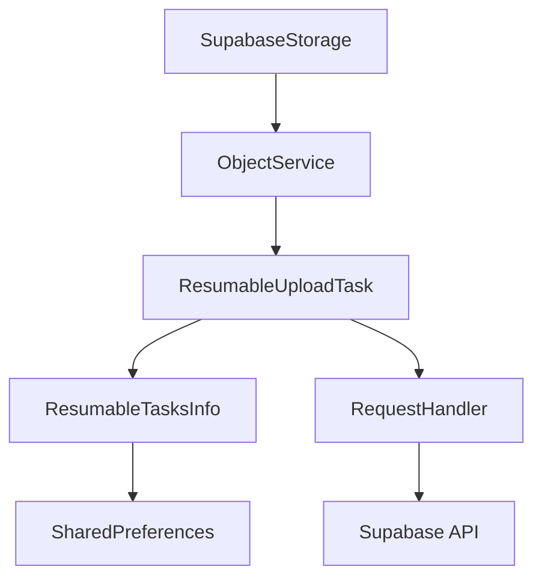

# Supabase Storage Android Library

A robust, asynchronous Java library for interacting with Supabase Storage in Android applications. This library provides a high-level API for managing buckets and objects, supporting standard and resumable uploads, downloads, and complex object manipulations.

## Overview

The Supabase Storage Android library is designed to simplify the integration of Supabase's storage capabilities into Android apps. It abstracts the underlying REST API and TUS protocol, providing a developer-friendly interface that handles networking, threading, and data serialization.

### Problem it Solves
- **Asynchronous Execution**: Offloads network operations to background threads to keep the UI responsive.
- **Resumable Uploads**: Handles large file transfers with the ability to resume after network failures.
- **Data Modeling**: Provides Java objects for buckets and storage objects, avoiding manual JSON parsing.
- **Progress Tracking**: Built-in support for monitoring upload and download progress.

### Architecture
The library follows a service-based architecture:
- **SupabaseStorage**: The main entry point and singleton client.
- **BucketService**: Handles bucket management operations.
- **ObjectService**: Handles object management (upload, download, list, etc.).
- **Tasks & Listeners**: Provides a `Task`-based API for handling asynchronous results and progress updates.
- **StorageTaskManager**: Manages specialized executor services for different storage operations.

## Features

- **Bucket Management**: Create, list, retrieve, update, delete, and empty buckets.
- **Standard Uploads**: Upload Files, byte arrays, or content from URIs.
- **Resumable Uploads**: Robust TUS-based uploads for large files with persistence.
- **Downloads**: Download objects to local files or memory (ByteArrayOutputStream).
- **Public Access**: Dedicated methods for downloading public objects.
- **Object Manipulation**: Move, copy, and delete objects within buckets.
- **Listing & Pagination**: List objects with support for limit, offset, and sorting.
- **Metadata Management**: Set content-type, cache-control, and custom metadata.
- **Progress Monitoring**: Real-time progress updates for transfers.

## Installation

```kotlin
plugins {
    id("io.github.maskmasteruk.supabase") version "0.0.1"
}

dependencies {
    implementation("io.github.maskmasteruk:supabase-android-core:0.0.1")
    implementation("io.github.maskmasteruk:supabase-android-storage:0.0.1")
}
```

## Requirements
- Android SDK 21+
- Java 8 or higher
- `supabase-core` module as a dependency

## Project Structure

- `io.github.maskmasteruk.supabase.storage`: Core client and service classes.
- `io.github.maskmasteruk.supabase.storage.Object`: Data models like `Bucket`, `SupabaseObject`, and `StorageMetadata`.
- `io.github.maskmasteruk.supabase.storage.Tasks`: Asynchronous task implementations.
- `io.github.maskmasteruk.supabase.storage.Callback`: Interface-based callbacks for simple operations.
- `io.github.maskmasteruk.supabase.storage.Listeners`: Generic listeners for `Task` results.
- `io.github.maskmasteruk.supabase.storage.Enum`: Enums for bucket types and sorting options.

## Library Architecture

### Request Flow
1. User calls a method on `SupabaseStorage`.
2. `SupabaseStorage` delegates to `BucketService` or `ObjectService`.
3. The service creates a `Task` and enqueues it in `StorageTaskManager`.
4. `StorageTaskManager` executes the task on a background thread.
5. The task performs a network request via `RequestHandler`.
6. Results are returned to the user through listeners/callbacks.

### Resumable Upload Flow
Uses the TUS protocol:
1. `ResumableUploadTask` checks `ResumableTasksInfo` (SharedPreferences) for an existing upload URL.
2. If found, it queries the server for the current offset.
3. If not found, it creates a new resumable URL.
4. Data is uploaded in chunks, reporting progress.
5. Upon completion, the cached info is removed.



## Complete API Documentation

### SupabaseStorage

The singleton entry point for all storage operations.

#### Methods

| Method | Return Type | Description |
|---|---|---|
| `getInstance(Context)` | `SupabaseStorage` | Returns the singleton instance. |
| `getBuckets(OnGetBuckets)` | `void` | Lists all buckets. |
| `uploadFile(reference, file)` | `UploadTask.Task` | Performs a standard file upload. |
| `uploadOrResumeFile(reference, file)` | `ResumableUploadTask.Task` | Performs a resumable file upload. |
| `download(reference, file)` | `DownloadTask.Task` | Downloads an object to a file. |
| `list(reference)` | `Task<ArrayList<SupabaseObject>>` | Lists objects at a path. |

**Example: Initialization**
```java
SupabaseStorage storage = SupabaseStorage.getInstance(context);
```

### SupabaseStorageReference

Used to define paths within buckets.

**Example: Building a Path**
```java
SupabaseStorageReference ref = new SupabaseStorageReference("my-bucket")
    .child("images")
    .child("profile.jpg");
```

### StorageMetadata

Defines properties for uploaded objects.

**Example: Setting Metadata**
```java
StorageMetadata metadata = new StorageMetadata()
    .setContentType("image/png")
    .upsert();
```

## Usage Guide

### Creating the Client
Initialize the client using an Android Context. It is recommended to do this once and reuse the instance.
```java
SupabaseStorage storage = SupabaseStorage.getInstance(getApplicationContext());
```

### Uploading Files (Standard)
Best for small files.
```java
File file = new File(getFilesDir(), "test.txt");
SupabaseStorageReference ref = new SupabaseStorageReference("documents").child("test.txt");

storage.uploadFile(ref, file)
    .addOnProgressListener(progress -> Log.d("Upload", "Progress: " + progress + "%"))
    .addOnSuccessLister(obj -> Log.d("Upload", "Success: " + obj.getName()))
    .addOnFailureListeners(error -> Log.e("Upload", "Error: " + error.getErrorMessage()));
```

### Resumable Uploads
Recommended for large files or unstable connections.
```java
storage.uploadOrResumeFile(ref, file)
    .addOnProgressListener(progress -> updateUI(progress))
    .addOnSuccessListener(task -> {
        showToast("Upload Complete");
    });
```

### Downloading Files
```java
File dest = new File(getExternalFilesDir(null), "downloaded_image.png");
storage.download(ref, dest)
    .addOnSuccessListener(websocketResult -> {
        File downloadedFile = (File) websocketResult;
        // Process file
    });
```

### Error Handling
Errors are returned as `SupabaseError` objects containing messages and details.
```java
.addOnFailureListeners(error -> {
    if (error.getErrorCode() != null) {
        // Handle specific error code
    }
    Log.e("Supabase", error.getErrorMessage());
});
```

## Best Practices

- **Threading**: All callbacks and listeners are executed on background threads. Use `runOnUiThread` or a `Handler` to update the UI.
- **Lifecycle**: While the library manages its own background tasks, consider canceling or ignoring results if the Activity is destroyed.
- **Large Uploads**: Always use `uploadOrResume` for files larger than a few megabytes.
- **Security**: Ensure your Supabase RLS policies are correctly configured for your buckets.

## FAQ

**Q: How do I overwrite an existing file?**
A: Use `StorageMetadata.upsert()` when calling the upload methods.

**Q: How do I handle progress in a ViewModel?**
A: Use `LiveData` or `Flow` to post progress updates from the task listeners to your UI.

## Troubleshooting

- **SocketTimeoutException**: Check your internet connection or increase timeouts in `DownloadTask`/`UploadTask`.
- **403 Forbidden**: Verify your authentication token and bucket RLS policies.
- **File not found**: Ensure you have requested the necessary storage permissions on Android.
